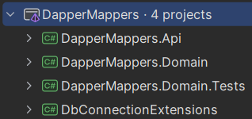

# DapperMappers

[](https://github.com/kubagdynia/DapperMappers/actions?query=branch%3Amaster)

An example of using Dapper with the custom Xml and Json mappers. Can be used to serialize and deserialize objects by Dapper.

### Project structure

- DapperMappers.Api - Sample REST API that uses serialization and deserialization to XML (uses the MS SQL Server Express database)
- DapperMappers.Domain - Sample domain used by the REST API
- DapperMappers.Domain.Tests - Domain tests using SQLite database
- DbConnectionExtensions - DBConnection extension

### How to use
- Create a class that implements IXmlObjectType or IJsonObjectType interface
```csharp
public class Book
{
	public long Id { get; set; }
	public string Title { get; set; }
	public BookDescription Description { get; set; }
}

public class BookDescription : IXmlObjectType
{
	public Learn Learn { get; set; }
	public string About { get; set; }
	public Features Features { get; set; }
}

public class Learn
{
	public List<string> Points { get; set; }
}

public class Features
{
	public List<string> Points { get; set; }
}
```
- Register these new classes in Startup.cs
```csharp
services.RegisterDapperCustomTypeHandlers(typeof(Book).Assembly);
```
- Create a table in the database that contains a column of the XML type
```sql
CREATE TABLE [dbo].[Books](
	[Id] bigint IDENTITY(1,1) NOT NULL,
	[Title] nvarchar(200) NOT NULL,
	[Description] xml NULL
	CONSTRAINT [PK_Books] PRIMARY KEY CLUSTERED
	(
		[Id] ASC
	)
)
```
- Use Dapper to save object data in the database
```csharp
public async Task SaveBook(Book book)
{
	using (var conn = _connectionFactory.Connection())
	{
		await conn.ExecuteAsync(_@"INSERT INTO Books (Title, Description) VALUES (@Title, @Description)", book);
	}
}
```

### How to Run test REST API
- Download and install [.NET 8.0 SDK](https://dotnet.microsoft.com/en-us/download/dotnet/8.0)
- Download and install [MS SQL Server Express](https://learn.microsoft.com/en-us/sql/database-engine/configure-windows/sql-server-express-localdb)
- Create an empty database called BookDB and run [CreateDapperMappersDbSQLServer.sql](https://github.com/kubagdynia/DapperMappers/blob/master/Sql/CreateDapperMappersDbSQLServer.sql) script
- Clone or download source code
```
git clone https://github.com/kubagdynia/DapperMappers.git
```
- Set a database connection string in the API project in the [appsettings.json](https://github.com/kubagdynia/DapperMappers/blob/master/DapperMappers/DapperMappers.Api/appsettings.json)
```json
{
  "ConnectionStrings": {
    "DefaultConnection": "Data Source=(localdb)\MSSQLLocalDB;Initial Catalog=BookDB;Integrated Security=True;MultipleActiveResultSets=True;"
  }  
}
```
- If you are running from IDE set the Startup Item to the DapperMappers.API project, not IIS Express
- Running the API project from the command line
```
dotnet run --project .\DapperMappers\DapperMappers.Api\
```
- Open the API documentation in your browser
```
https://localhost:5001/swagger
```


### How to Test
Every commit or pull request is built and tested on the Continuous Integration system.

To test locally:
- Download and install [.NET 8.0 SDK](https://dotnet.microsoft.com/en-us/download/dotnet/8.0)
- Clone or download source code
```
git clone https://github.com/kubagdynia/DapperMappers.git
```
- Start tests from the command line
```
dotnet test ./DapperMappers/
```

### Technologies
List of technologies, frameworks and libraries used for implementation:
- [.NET 8.0](https://dotnet.microsoft.com/en-us/download/dotnet/8.0) (platform)
- [MS SQL Server Express](https://learn.microsoft.com/en-us/sql/database-engine/configure-windows/sql-server-express-localdb) (database)
- [Dapper](https://github.com/StackExchange/Dapper) (micro ORM)
- [Dapper.CustomTypeHandlers](https://github.com/kubagdynia/Dapper.CustomTypeHandlers) (custom handlers)
- [Automapper](https://github.com/AutoMapper/AutoMapper) (object mapper)
- [FluentValidation](https://fluentvalidation.net/) (data validation)
- [System.Text.Json](https://www.nuget.org/packages/System.Text.Json) (JSON serialization/deserialization)
- [Swashbuckle.AspNetCore](https://github.com/domaindrivendev/Swashbuckle.AspNetCore) (Swagger automated API documentation)
- [NUnit](https://nunit.org/) (testing framework)
- [SQLite](https://www.sqlite.org/) (database for testing purpose)
- [FluentAssertions](https://github.com/fluentassertions/fluentassertions) (fluent API for asserting the result of unit tests)

### License
This project is licensed under the [MIT License](https://opensource.org/licenses/MIT).
